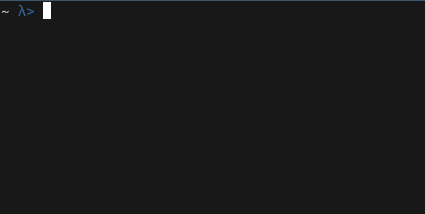

# suBASHtion

Subashtion is a cli tool that allows you to subscribe to youtubers without a google account.

## commands

To add a new youtube account type `sb add "username" "userid"` to get the userid
go to [vid.puffyan.us](https://vid.puffyan.us) and search the person you want
to subscibe to.

To remove a youtube account type `sb remove "username"`.

You can use the `sb list` command to list all the accounts you subscribed to.

If you want to check if someone uploaded a new video just type `sb` without any
command.

You can also use the `sb check "username"` command to only check if one person 
uploaded a new video.

## dependencies

You only need `awk` and a `notification-daemon`.

## known problems

- if a youtube account you subscribed to changes the name of their latest video the script will think that the youtube account uploaded a new video

## Demo

